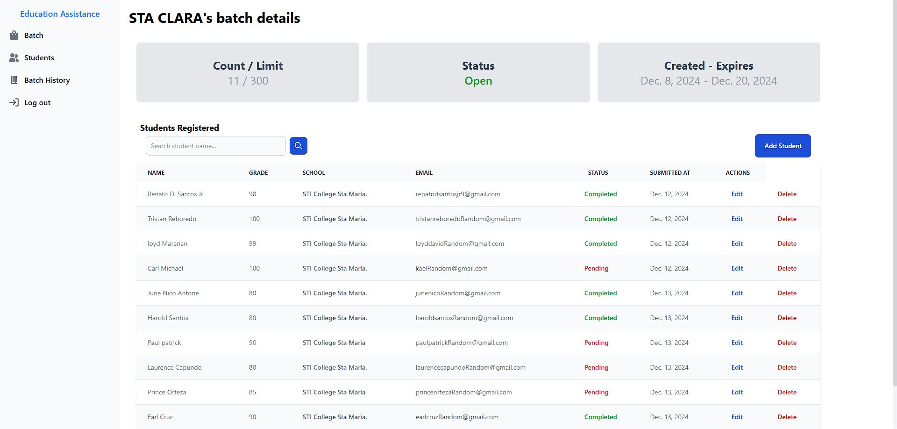

# Educational Assistance System



_Built for educational assistance workers for easy management_

This platform empowers government agencies to efficiently manage educational assistance programs. 
With a user-friendly interface and comprehensive tools, it simplifies the allocation, tracking, and reporting of aid, enhancing productivity and transparency. 
The system ensures fair and efficient distribution of resources, helping students receive the support they need.

---

## Tech Stack
**Django**, **Tailwind css**, **SQL Lite**

## Features
- User authentication and authorization
- Modern and Simple Interface
- Dashboard for handling Educational Assistance Information
- Can be used by many Educational AssistancWorkers
- Team Connect (Not Implemented Yet)

## Setup Instructions

### Prerequisites
1. Make sure you have the following installed:
    - [python](https://www.python.org/) (python 3 recommended)
    - [pip] (https://packaging.python.org/en/latest/tutorials/installing-packages/)

2. Clone the repository:
    ```bash
        git clone https://github.com/sheeshhhhhh/Educational-Assistance-Information-System.git
    ```

3. Create a Venv:
    ```bash
        python -m venv venv
    ```

4. Activate venv and install packages:
    **Window**
    ```bash
        ./venv/Scripts/activate
        pip install -r requirements.txt
    ```
    **Linux**
    ```bash
        source venv_name/bin/activate
        pip install -r requirements.txt
    ```

5. Start:
    ```bash
        cd EducationalAssistance
        python manage.py runserver
    ```